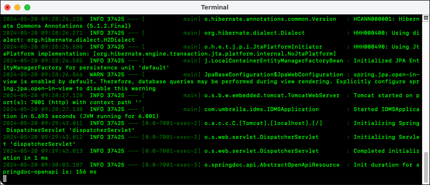

# Backend IDMS Mockup

This repository contains a microservice that emulates a customer's homegrown identity management system.

## Table of Contents
1. [Implementation Overview](#implementation-overview)
2. [Instructions](#instructions)
3. [Reporting Issues](#reporting-issues)

## Implementation Overview
We implemented this microservice using the following technology stack:
- Java 11
- Spring Boot 2.6.3

The build creates a runnable JAR.

## Instructions
1. Download this repo or clone it.
    ```sh
    git clone https://github.com/abelisle-mulesoft/backend-idms.git
    ```
2. Open a command or shell window and change directory to the root of the project.
3. Optionally, compile this project as a smoke test.
    1. On Linux or macOS:
        ```sh
        ./mvnw clean compile
        ```
    2. On Windows:
        ```sh 
        mvnw.cmd clean compile
        ```
4. Run the project
    1. On Linux or macOS:
        ```sh
        ./mvnw spring-boot:run
        ```
    2. On Windows:
        ```sh 
        mvnw.cmd spring-boot:run
        ```
   

## Reporting Issues

You can report new issues at this link [https://github.com/abelisle-mulesoft/backend-idms/issues](https://github.com/abelisle-mulesoft/backend-idms/issues).
