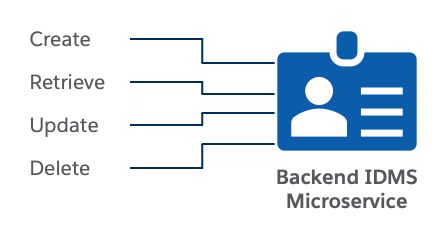

# Welcome to the API Portal of the Backend IDMS Microservice

This microservice emulates a customer's homegrown identity management system (IDMS). We designed and implemented it to support demoing bidirectional synchronizations of identities between Salesforce and the homegrown IDMS (e.g., new and updated identities in either system automatically synching to the other). In the current version, the Backend IDMS microservice supports the following methods:

1. Create a new identity.
2. Retrieve all identities.
3. Retrieve an identity by its ID.
4. Update an identity.
5. Delete an identity.

Refer to the ***Summary*** section for further details on these methods and their expected behavior.
