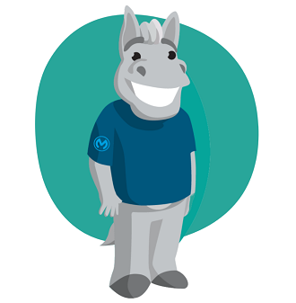

# Welcome to the API Portal of the Backend IDMS Microservice

This microservice emulates a customer's homegrown identity management system (IDMS). We designed and implemented it to support demoing a bidirectional integration between Salesforce and the homegrown IDMS (e.g., new and updated identities in either system automatically synching to the other).

